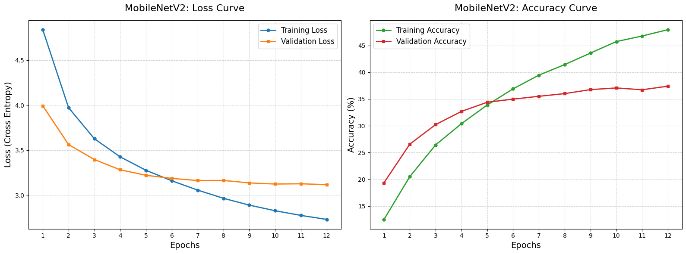
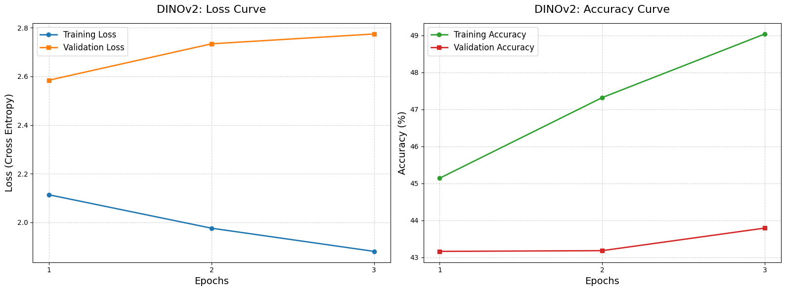

# Scene Classification

_This project was developed during an internship at EICT IIT Guwahati under the guidance of Prithvijit Guha Sir._


An advanced deep learning system designed for multi-model scene classification across **314 distinct environments**, using a curated subset of the MIT Places365 dataset.

The project benchmarks a lightweight Convolutional Neural Network, **MobileNetV2**, against a Vision Transformer, **DINOv2 (ViT-S/14)**. The system also provides a full-stack web application for real-time dual-model inference and side-by-side comparison of scene predictions.

---

## Project Resources

- **Detailed Progress Report:** [Scene Classification Progress Report](./Scene_Classification_Progress_Report.pdf)
- **Progress Report – Notion:** [View Progress Report on Notion](https://app.notion.com/p/Scene-Classification-38594c0acda780a2afbfce1794ce6a36?source=copy_link)
- [GitHub Page](https://Bhargav-Das-12.github.io/Scene_Classification/) - GitHub Page for this Project.
- **Video Demonstration:** [Watch the Demo on YouTube](https://youtu.be/Jz3pot37TLA)

---

## Overview

The project evaluates two fundamentally different approaches to scene classification:

- **MobileNetV2:** A lightweight CNN selected for computational efficiency and suitability for real-time or edge deployment.
- **DINOv2:** A Vision Transformer used as a powerful feature extractor with a custom classification head for semantic scene understanding.

The primary objective is to compare classification performance against computational requirements, particularly in terms of:

- Top-1 Accuracy
- Top-5 Accuracy
- Cross-Entropy Loss
- Parameter Count
- FLOPs
- Inference Latency

### Models Evaluated

| Model                 | Architecture       | Training Strategy                 |
| --------------------- | ------------------ | --------------------------------- |
| **MobileNetV2**       | Lightweight CNN    | Final 5 feature blocks fine-tuned |
| **DINOv2 (ViT-S/14)** | Vision Transformer | Frozen backbone + custom MLP head |

### Classification Target

**314 distinct real-world scene categories**

### Loss Function

**Cross-Entropy Loss**

---

## Dataset

This project uses a curated subset of the original **MIT Places365** dataset for efficient experimentation across **314 distinct scene categories**.

- **Raw Dataset Source:** [Kaggle Places365 Dataset](https://www.kaggle.com/datasets/pankajkumar2002/places365)
- **Processed Dataset:** [Organized Dataset – Google Drive](https://drive.google.com/file/d/1Hh9pWRZChD8zzoSHDsptuxQzO1qCtkSA/view?usp=drive_link)

  _The processed dataset contains images organized into PyTorch-ready class directories for the corresponding train, validation, and test splits._

### Dataset Preparation

The available images were reorganized using an automated preprocessing pipeline. The pipeline uses the official Places365 class mappings to associate images with their corresponding scene categories and arrange them into class-specific directories.

The resulting structure is suitable for direct use with PyTorch image classification workflows.

---

## Performance & Evaluation

The models were evaluated on a held-out test dataset of **7,302 images** across 314 scene categories.

### Final Test Set Accuracy

| Model                 | Top-1 Accuracy | Top-5 Accuracy |
| --------------------- | -------------: | -------------: |
| **MobileNetV2**       |     **37.72%** |     **71.25%** |
| **DINOv2 (ViT-S/14)** |     **43.18%** |     **76.31%** |

**Top-1 Accuracy** measures whether the model's highest-confidence prediction matches the correct class.

**Top-5 Accuracy** measures whether the correct class appears among the model's five highest-confidence predictions, which is particularly useful for semantically similar environments.

---

## Computational Efficiency

Real-world deployment feasibility was evaluated using model parameter counts, FLOPs analysis, and GPU inference latency measurements.

| Metric                 |       MobileNetV2 | DINOv2 (ViT-S/14) |
| ---------------------- | ----------------: | ----------------: |
| **Parameter Count**    |     ~2.62 Million |    ~21.88 Million |
| **Computational Cost** |  **0.653 GFLOPs** |     11.050 GFLOPs |
| **Average Latency**    | **6.41 ms/image** |     7.87 ms/image |

### Performance Observation

DINOv2 achieves higher classification accuracy, reaching **43.18% Top-1** and **76.31% Top-5 accuracy** on the final test set.

MobileNetV2 requires substantially fewer parameters and approximately **1/17th of the FLOPs** of DINOv2, while also achieving slightly lower measured inference latency in the evaluated setup.

This highlights the trade-off between computational efficiency and semantic representation capability.

---

## Training Results

### MobileNetV2

The MobileNetV2 model was trained by fine-tuning the final five feature blocks while keeping the earlier feature extraction layers frozen.



The training curves show a steady increase in training accuracy and a gradual decrease in training loss. Validation accuracy improves initially and begins to plateau during the later epochs.

### DINOv2

DINOv2 uses a frozen Vision Transformer backbone with a custom MLP classification head trained for the 314 scene categories.



The DINOv2 training curves show rapid improvement in training accuracy during the initial epochs. Validation loss begins increasing while validation accuracy remains comparatively stable, motivating early stopping.

---

## Pipeline Architecture & Data Flow

The system processes an uploaded image through the React frontend and FastAPI backend before generating predictions from both models.

```text
                 ┌───────────────────────┐
                 │   Local Image Upload  │
                 │      React UI         │
                 └───────────┬───────────┘
                             │
                             ▼
                 ┌───────────────────────┐
                 │  FastAPI Backend      │
                 │      /predict         │
                 └───────────┬───────────┘
                             │
                             ▼
                 ┌───────────────────────┐
                 │ PyTorch Preprocessing │
                 │ Resize 256 × 256      │
                 │ Center Crop 224 × 224 │
                 │ ImageNet Normalize    │
                 └───────────┬───────────┘
                             │
                    ┌────────┴────────┐
                    ▼                 ▼
          ┌────────────────┐   ┌────────────────────┐
          │  MobileNetV2   │   │ DINOv2 (ViT-S/14) │
          │ Fine-tuned CNN │   │ Frozen Transformer │
          └───────┬────────┘   └──────────┬─────────┘
                  │                       │
                  └──────────┬────────────┘
                             ▼
                 ┌───────────────────────┐
                 │ Softmax + torch.topk  │
                 │     Top-5 Extraction  │
                 └───────────┬───────────┘
                             │
                             ▼
                 ┌───────────────────────┐
                 │ Top-5 Predictions     │
                 │ Confidence Scores     │
                 └───────────┬───────────┘
                             │
                             ▼
                 ┌───────────────────────┐
                 │ React Comparison      │
                 │ Dashboard             │
                 └───────────────────────┘
```

### Inference Process

1. The user uploads an image through the React interface.
2. The image is sent to the FastAPI `/predict` endpoint.
3. The backend converts the image to RGB and applies the required transformations:
   - Resize to **256 × 256**
   - Center crop to **224 × 224**
   - ImageNet normalization
4. The processed image is passed through both MobileNetV2 and DINOv2.
5. The model logits are converted into probabilities using Softmax.
6. `torch.topk` extracts the five highest-scoring predictions.
7. The predictions and confidence scores are returned as a JSON response.
8. The React frontend displays the results for both models side-by-side.

---

## Getting Started

### Prerequisites

Make sure the following are installed:

- Python 3.11
- pip
- Node.js 16+
- npm
- Git

### 1. Clone the Repository

```bash
git clone https://github.com/YourUsername/Scene-Classification.git
cd Scene-Classification
```

> Replace `YourUsername` with the actual GitHub username/repository URL.

### 2. Create the Python Environment

```bash
python -m venv venv
```

#### Windows PowerShell

```powershell
.\venv\Scripts\Activate.ps1
```

#### macOS/Linux

```bash
source venv/bin/activate
```

Install the required Python packages:

```bash
pip install -r requirements.txt
```

### 3. Backend Setup

Navigate to the backend:

```bash
cd backend
```

Make sure the trained `.pth` model weights are present in the `backend` directory.

Start the FastAPI server:

```bash
uvicorn main:app --reload
```

The backend will be available at:

```text
http://127.0.0.1:8000
```

The models are initialized during application startup.

### 4. Frontend Setup

Open a separate terminal and navigate to the frontend:

```bash
cd frontend
```

Install the dependencies:

```bash
npm install
```

Start the development server:

```bash
npm run dev
```

The React application will normally be available at:

```text
http://localhost:5173
```

---

## Project Structure

```text
Scene_Classification/
│
├── backend/
│   ├── main.py
│   ├── best_scene_classifier.pth
│   └── mobilenet_scene_classifier-final.pth
│
├── frontend/
│   ├── src/
│   │   └── App.jsx
│   └── package.json
│
├── notebooks/
│   ├── dataset_modification.ipynb
│   ├── MobileNet_model_training-final.ipynb
│   └── DINOV2_model_training.ipynb
│
├── results/
│   ├── mobile_net_main.png
│   └── dinov2_main.png
│
├── Scene_Classification_Progress_Report.pdf
├── README.md
├── requirements.txt
├── .gitignore
└── LICENSE
```

### Directory Description

| Directory/File                             | Description                                                              |
| ------------------------------------------ | ------------------------------------------------------------------------ |
| `backend/`                                 | FastAPI backend and PyTorch inference pipeline                           |
| `frontend/`                                | React/Vite web application                                               |
| `notebooks/`                               | Dataset preparation, model training, evaluation, and profiling notebooks |
| `results/`                                 | Training accuracy and loss curves                                        |
| `*.pth`                                    | Trained model weights                                                    |
| `Scene_Classification_Progress_Report.pdf` | Detailed project progress report                                         |
| `requirements.txt`                         | Python dependencies                                                      |
| `.gitignore`                               | Files excluded from version control                                      |
| `LICENSE`                                  | MIT License                                                              |

---

## Author

**Bhargav Das**

---

## License

MIT License.
